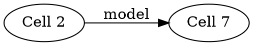

# Cell dependency graph

ASTScribe can reconstruct a framework-agnostic static dependency graph between notebook cells without executing the notebook.

The graph is based on ordered Python symbol events rather than ML-framework semantics. It complements the experiment pipeline: the pipeline describes methodological stages, while the dependency graph describes how notebook cells exchange named values.

## Public API

```python
from astscribe import NotebookAnalyzer

notebook = NotebookAnalyzer.from_ipynb("experiment.ipynb")

graph = notebook.dependency_graph()
print(graph.render())
print(graph.to_dict())
print(graph.to_dot())
```

Convenience methods are also available:

```python
notebook.render_dependency_graph()
notebook.dependency_dot()
```

No Graphviz package is required. `to_dot()` returns plain DOT source only.

## Nodes

Each analyzed code cell becomes a `CellDependencyNode` containing:

- the original notebook cell index;
- symbols defined by supported source constructs;
- symbols read by supported source constructs;
- non-builtin reads for which no prior producer was observed.

Original `.ipynb` indices are preserved, so Markdown cells or skipped cells can leave gaps in graph node identifiers.

## Edges

An edge means that a supported symbol read in one cell resolved to a symbol produced by an earlier analyzed cell.

For example:

```python
# Cell 2
model = build_model()

# Cell 7
outputs = model(inputs)
```

produces an edge equivalent to:

```text
Cell 2 -> Cell 7 [model]
```

Multiple symbols flowing between the same pair of cells are aggregated on one edge.

## Flow-sensitive producer resolution

ASTScribe processes supported reads and writes in syntactic execution order. This matters for reassignment:

```python
# Cell 1
x = 10

# Cell 4
x = x + 1
```

The read of `x` in cell 4 depends on cell 1 before cell 4 becomes the new producer of `x`.

Future reads then resolve to cell 4.

Imports in the same cell are handled similarly:

```python
import torch
x = torch.tensor([1, 2, 3])
```

The use of `torch` does not create a cross-cell dependency because the import already produced it in the current cell.

## Redefinitions

`NotebookDependencyGraph.redefinitions` records when a notebook-global symbol is replaced by a later cell.

This is useful for notebooks where names such as `model`, `dataset`, `optimizer`, or `config` are repeatedly rebound during experimentation.

A redefinition is not automatically an error. It is recorded as structural information for diagnostics and tooling.

## Unresolved reads

A read is listed in `unresolved_reads` when ASTScribe cannot associate it with a prior supported notebook-global producer and it is not a Python builtin.

Examples can include:

- a value injected by the notebook environment;
- a symbol created by skipped IPython-specific syntax;
- a symbol defined dynamically;
- an actual missing dependency;
- a value supplied by an unsupported control-flow or scope pattern.

Therefore `unresolved_reads` means **unresolved statically**, not necessarily undefined at runtime.

## Scope handling

The current graph intentionally avoids several common false dependencies:

- comprehension targets are treated as comprehension-local;
- function bodies are not considered executed merely because a function is defined;
- function default expressions are analyzed because they are evaluated at definition time;
- class bodies are analyzed because they execute when the class is defined, while class-local bindings do not become notebook globals;
- annotation-only names such as `x: int` are not treated as runtime value producers;
- nested comprehensions and nested classes do not capture an outer class namespace as a lexical scope;
- a comprehension's outermost iterable is evaluated in the surrounding scope before the comprehension scope begins, matching Python's execution model;
- attribute or subscript assignment does not create a new notebook-global symbol, although its base/index expressions can be read;
- `del name` removes that name as a future static producer.

## Control-flow model

The v0.6 graph is flow-sensitive to supported syntactic event order but is **not branch-sensitive**.

ASTScribe does not attempt to prove which branch of an `if`, `try`, or other conditional construct executed in a historical notebook session. Definitions inside supported control-flow syntax are therefore structural static observations, not proof of runtime state.

This is deliberate. A future control-flow graph layer could represent alternative reaching definitions explicitly, but v0.6 does not collapse that uncertainty into a false runtime claim.

## Function and class definitions

Function bodies are not traversed as immediate execution dependencies. References used only when the function is later called therefore do not create an edge at definition time.

Expressions evaluated while defining the function, such as defaults and decorators, can create dependencies.

Class bases, class keywords, decorators, and class-body statements are analyzed. Reads from earlier notebook cells can therefore create dependency edges during class definition, while assignments, imports, and method names created inside the class remain class-local. Class namespaces are not treated as closure scopes for nested comprehensions or nested classes, matching Python name-resolution behavior more closely.

## DOT export

Example:



ASTScribe only creates the text. Rendering is optional and external.

The same export is available from the CLI:

```bash
astscribe experiment.ipynb --report dependencies --dot
```

## Explicit non-goals

The cell dependency graph does not claim to recover:

- historical Jupyter execution order;
- hidden kernel state;
- values created through arbitrary dynamic execution;
- runtime aliasing or object identity;
- branch/path feasibility;
- full Python interprocedural dataflow;
- mutation dependencies through every object attribute or container element;
- dependencies hidden inside skipped notebook magics or shell commands;
- dynamic imports or names constructed through reflection.

The guiding rule remains: expose useful static structure without presenting it as observed runtime behavior.
